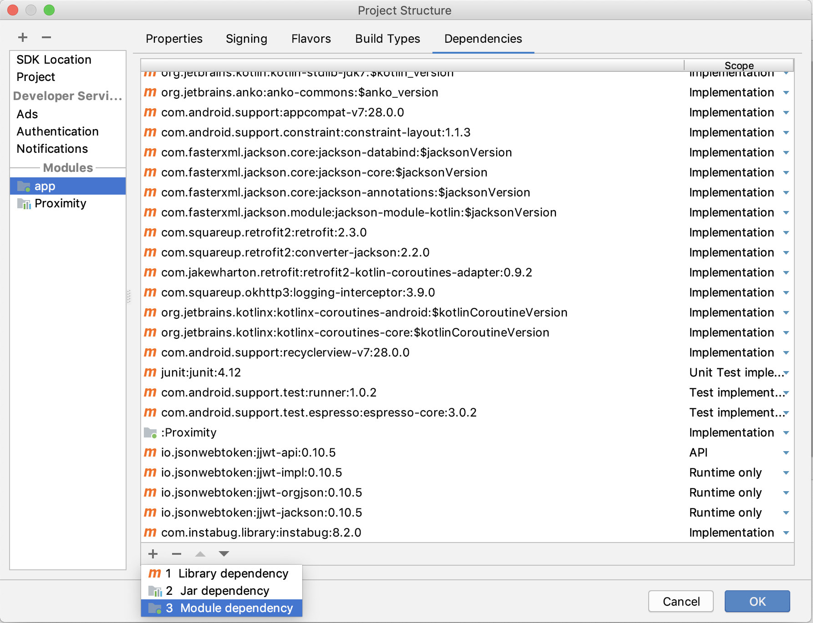

# Getting Started with the Android Proximity SDK

### Before You Begin
Before you can build and use the Proximity SDK on Android, the following must be true:

- You have a Financial Institution ID. This should be provided to you by Interac and will be used to generate a unique API Key.
- Your App min SDK supported is Android 6 or newer.

### Step 1 - Add the Proximity SDK to your native project

Manual installation

- Fetch .aar file from the repo
- Open up the project structure by choosing `File -> project structure`
- Click plus on top-left to add a new module
- on the New Modal window - select  import .AAR/.JAR package.
- Select the .aar file you downloaded and click finish.

- Now again on `project structure` widow click on your app module and go to dependencies tab.
- Click + on bottom-left and select `Module dependency` and select Proximity module as your dependency.

Add following in your module's build.gradle file, if you don't have them already

	 implementation "org.jetbrains.kotlin:kotlin-stdlib-jdk7:$kotlin_version"
     implementation 'org.jetbrains.kotlinx:kotlinx-coroutines-core:1.1.0'
     implementation 'org.jetbrains.kotlinx:kotlinx-coroutines-android:1.1.0'
     implementation 'com.github.bumptech.glide:glide:4.9.0'
     annotationProcessor 'com.github.bumptech.glide:compiler:4.9.0'

Sync your project gradle and you are good to go!

### Step 2 - Setup SDK

The SDK needs the following information:

- An INPCustomerInfo object: This object contains all the customer's information:

		interacUUID: String
		authToken: String
		firstName: String
		lastName: String
		listOfAccounts: List<INPAccount>
		sendLimit: Double? = null
		accountFee: Double? = null

You need to pass INPCustomerInfo on SDK Initialisation

- Auth token:  JSON Web Token created by your server using the `Financial Institution ID`, a shared secret and the following payload:

		{
			"sub": "<User Interac UUID>",
			"puid": "<Participant User ID>",
			"first_name": "<User First Name>",
			"last_name": "<User Last Name>"
		}

- An INPAccount object: This object represents a bank account

		accountId: String
		accountName: String
		accountNumber: String
		accountBalance: Double

	add all the account related to user as `listOfAccounts` in `INPCustomerInfo`

- An INPTheme object: This is how you can customize the appearance of the SDK for your brand:

You can add two base colors representing your brand - inpPrimaryColor and inpSecondaryColor and one contrast color for each.
Also add your logo drawable in your res/drawable folder and add it to syles as inpLogoImage

To apply your own theme to the SDK, declare following styles in your res/values/styles.xml file

		

Make sure to check following points

- Style should have a parent as `INP_Theme` and should also have the 4 color attributes with the same key as defined above.

- Make sure to add reference of color defined in your res/value/colors.xml file in theme, instead of adding color hex value.

- If your app uses theme from styles, then you need to add the following into your Manifest file <application> tag -
		`tools:replace="android:theme"`

### Step 3 - Create and show the SDK
Initialise SDK with above information

	val sdkInitializer = INPInitializer(customerInfo, this@MainActivityKotlin as INPProximityCallback)

Now lauch the SDK with your custom theme

	    sdkInitializer.launchProximity(this@HomeScreenActivity, theme)

### Step 4 - Listen to the SDK callbacks
The SDK is using INPProximityCallback interface to call back the app once a request or send transfer has been initiated.

	 fun showProximityError(errorMessage: String)
    fun sendProximityTransfer(transferInfo: INPTransferInfo, listener: ((Boolean, String) -> Unit))

`sendProximityTransfer` callback will pass on `transferInfo` it will have details needed to complete the transaction which user initiated in proximity flow

	selectedAccount: INPBankAccount
	recipientUUID: String
	nickname: String
	amount: Double

Complete the transaction using transferInfo details and pass on results to sdk using listener, return true if transfer is successfull or false with a custom error message to indicate the transfer failure.

`showProximityError` callback will pass on any error encountered in the proximity flow
